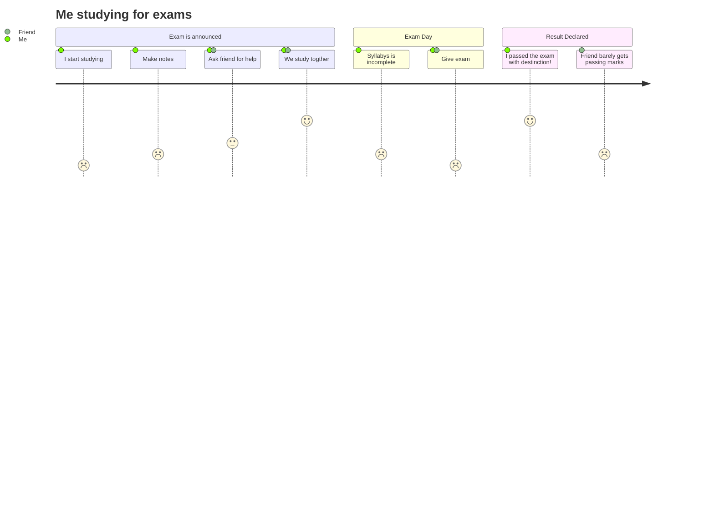
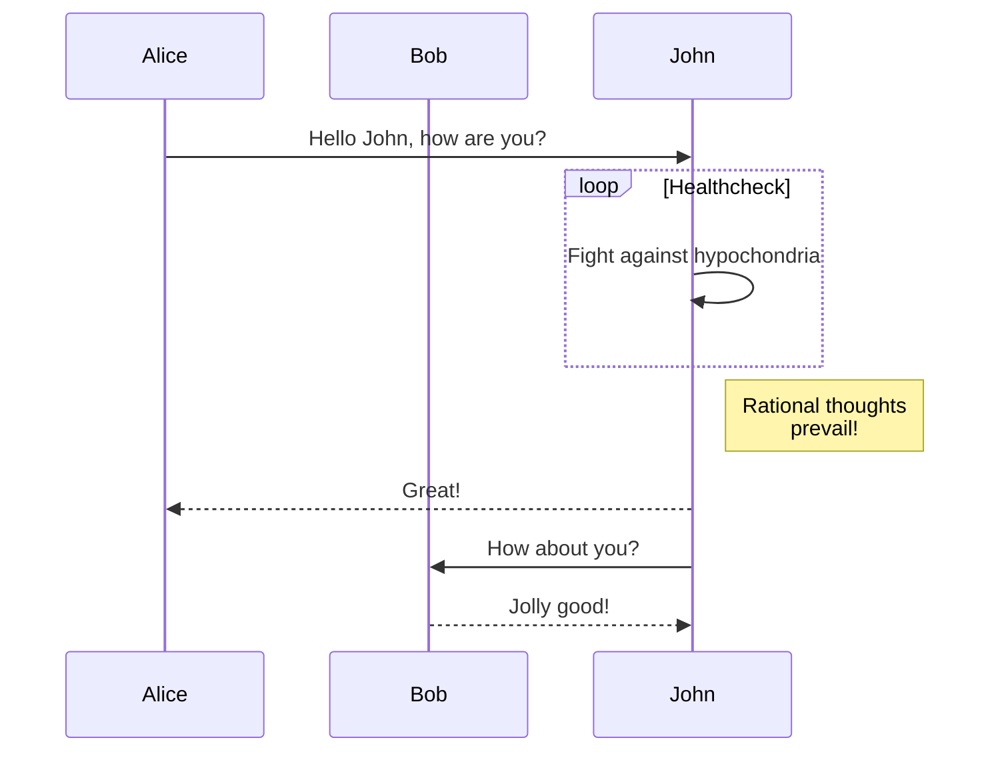
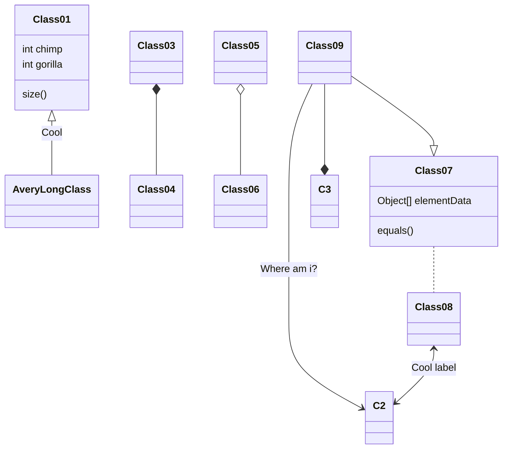

# Spielwiese

## Plantuml Test 

Hier ein Dokument

```plantuml
Bob -> Alice : hello
Alice -> Bob : hi
```

## Mermaid

Journey

```mermaid
journey
	title Me studying for exams
	section Exam is announced
		I start studying: 1: Me
		Make notes: 2: Me
		Ask friend for help: 3: Me, Friend
		We study togther: 5: Me, Friend
	section Exam Day
		Syllabys is incomplete: 2: Me
		Give exam: 1: Me, Friend
	section Result Declared
		I passed the exam with destinction!: 5: Me
		Friend barely gets passing marks: 2: Friend
```

sequenceDiagram

```mermaid
sequenceDiagram
    participant Alice
    participant Bob
    Alice->>John: Hello John, how are you?
    loop Healthcheck
        John->>John: Fight against hypochondria
    end
    Note right of John: Rational thoughts <br/>prevail!
    John-->>Alice: Great!
    John->>Bob: How about you?
    Bob-->>John: Jolly good!
```

ClassDiagram

```mermaid
classDiagram
Class01 <|-- AveryLongClass : Cool
Class03 *-- Class04
Class05 o-- Class06
Class07 .. Class08
Class09 --> C2 : Where am i?
Class09 --* C3
Class09 --|> Class07
Class07 : equals()
Class07 : Object[] elementData
Class01 : size()
Class01 : int chimp
Class01 : int gorilla
Class08 <--> C2: Cool label
```

